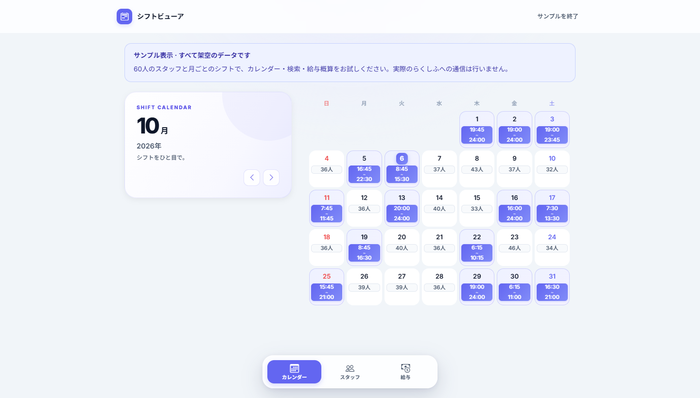
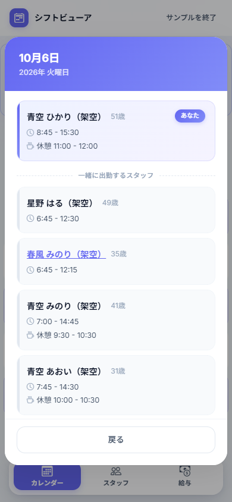
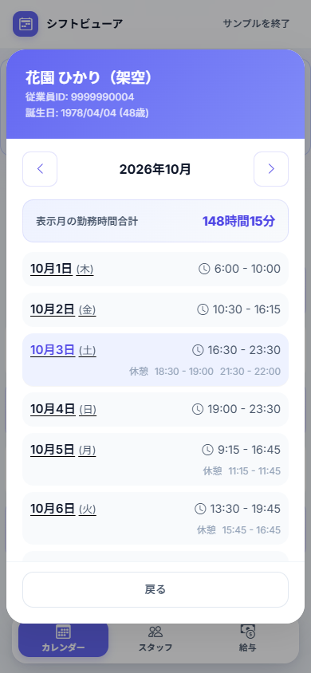
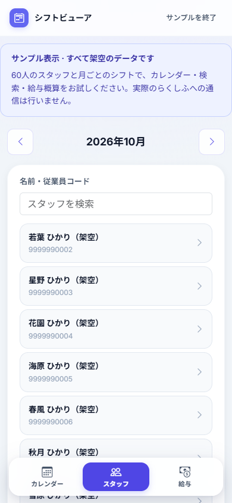

<h1 align="center">rakushifu-viewer</h1>

<p align="center">
  らくしふのシフト・メンバー情報を閲覧し、予定シフトから給与を概算する非公式Webアプリ。
</p>

<p align="center">
  <a href="https://github.com/tksugi/rakushifu-viewer/actions/workflows/ci-deploy.yml?query=branch%3Adev"></a>
  <a href="docs/setup.md#必要なツール"></a>
  <a href="docs/usage.md"></a>
</p>

<p align="center">
  <a href="#クイックスタート"><strong>起動手順</strong></a> &nbsp; · &nbsp;
  <a href="#画面例"><strong>画面例</strong></a> &nbsp; · &nbsp;
  <a href="docs/usage.md"><strong>使い方</strong></a> &nbsp; · &nbsp;
  <a href="docs/setup.md#workersの起動デプロイ"><strong>Workersの準備</strong></a>
</p>

---

すかいらーくグループ向けの従業員アカウントが対象で、接続先の企業コードは `skylark` 固定です。らくしふの公式提供・公認ツールではありません。シフトの登録・変更や、らくしふへの給与設定の書き込みは行いません。

## クイックスタート

ローカル版にはPython 3.10以上とGitを使います。Node.jsは不要です。依存ライブラリはプロジェクト内の `.venv` に導入します。

> [!NOTE]
> `APP_ENV=test` はローカル向けの保存方式を選ぶ設定です。通常のログインでは実際のらくしふへ認証情報を送信し、シフトを取得します。架空データで試す場合は、起動後に「ログインなしでサンプルを試す」を選んでください。

Windows / PowerShell:

```powershell
git clone https://github.com/tksugi/rakushifu-viewer.git
cd rakushifu-viewer
python -m venv .venv
.\.venv\Scripts\python.exe -m pip install -r requirements-local.txt
$env:APP_ENV = "test"
.\.venv\Scripts\python.exe api.py
```

<details>
<summary>macOS / Linuxの起動手順</summary>

```sh
git clone https://github.com/tksugi/rakushifu-viewer.git
cd rakushifu-viewer
python3 -m venv .venv
.venv/bin/python -m pip install -r requirements-local.txt
APP_ENV=test .venv/bin/python api.py
```

</details>

[http://127.0.0.1:5000](http://127.0.0.1:5000)を開きます。

- **サンプルを試す:** 「ログインなしでサンプルを試す」を選択します。60人の架空スタッフと、日勤・深夜勤務・休憩を含むシフトを表示します。この表示ではらくしふへ通信しません。
- **自分のシフトを見る:** らくしふの従業員IDとパスワードでログインします。

終了はターミナルで `Ctrl+C` を押します。プロセスを終了するとローカルのセッションは失われます。ローカル版を削除する場合は、停止後に取得したプロジェクトのフォルダーを削除してください。ブラウザに保存された給与設定は、別途そのサイトのデータを削除すると消えます。

起動できない場合や設定を変える場合は、[起動・デプロイガイド](docs/setup.md)を参照してください。ルートの `pyproject.toml` はWorkers向けのため、ローカル版の依存導入には使いません。

## 主な機能

| 機能 | 内容 |
| --- | --- |
| 月間カレンダー | 自分の出退勤時刻と、自分が勤務しない日の出勤人数を表示。前月・翌月へ切り替え |
| 日別一覧 | メンバー、勤務時刻、休憩を表示。自分と勤務時間が重なる人、退勤時刻が同じ人を識別 |
| メンバー検索 | 表示月のデータから、名前・従業員コードで部分一致検索 |
| メンバー詳細 | 名前、従業員コード、誕生日・年齢と月間シフト、休憩控除後の勤務時間を表示 |
| 給与概算 | 自分の予定シフトを使い、時給・深夜割増率から月の給与を計算 |

検索対象は、自店舗に所属する人と、表示月に自店舗で勤務する人です。自分自身は検索結果に含めません。取得データにない情報は表示できません。

給与は予定ベースの概算です。実際の勤怠、残業・休日割増、交通費、税金などは反映しません。操作方法と計算条件は[利用ガイド](docs/usage.md)に記載しています。

## 画面例

以下はすべて架空の従業員・架空のシフトを使った画面です。実際の従業員情報や勤務予定は含みません。

<p align="center">
  
  <br>
  <sub>PC：月間カレンダーと自分の勤務予定</sub>
</p>

### スマートフォンでの表示

カレンダーの日付から日別の勤務メンバーを開き、スタッフ名を選ぶとその人の月間シフトを確認できます。

<table align="center">
  <tr>
    <th align="center">日別の勤務メンバー</th>
    <th align="center">スタッフの月間シフト</th>
  </tr>
  <tr>
    <td align="center"></td>
    <td align="center"></td>
  </tr>
  <tr>
    <th align="center">スタッフ一覧（名前未入力）</th>
    <th align="center">給与概算</th>
  </tr>
  <tr>
    <td align="center"></td>
    <td align="center"></td>
  </tr>
</table>

---

## Cloudflare Workersで実行する

Workers版はCloudflare上への公開と、Workersのローカル開発環境に対応しています。Python・uv・Node.jsなどの準備、ビルド、デプロイの手順は[起動・デプロイガイド](docs/setup.md#workersの起動デプロイ)を参照してください。

> [!WARNING]
> ビルド準備の `scripts/prepare_worker.py` は `.worker-build` 全体を削除して再作成します。その中のローカルセッションも失われます。

`main` へのpushと `main` の手動ワークフロー実行は、テスト成功後にCloudflareへ自動デプロイします。`dev` へのpushと `main`・`dev` 向けPRではテストだけを実行します。[GitHub Actionsの設定](docs/setup.md#github-actionsから自動デプロイする)を確認してから運用してください。

既存ドキュメントに記録された実接続の確認範囲はFlask版です。Workers版は起動・デプロイ・未認証時の応答を確認していますが、実アカウントでのログイン・シフト取得は未確認です。

## 認証とデータの扱い

通常のログインでは、アプリのサーバーが従業員IDとパスワードを受け取り、らくしふの認証APIへ送信します。パスワードを保存する処理はありません。本人・所属店舗・所属業態は、認証後の利用者情報から特定します。画面の表示には外部CDNのBootstrapとGoogle Fontsも読み込みます。

ブラウザには、らくしふの認証Cookieとは別のアプリ用Cookieを渡します。ログアウトするとアプリのセッションを削除します。給与計算の入力値はブラウザの `localStorage` に保存され、ログアウト後も残ります。削除するには、そのサイトのブラウザ保存データを消してください。

<details>
<summary>セッションの保存場所とCookie属性</summary>

Flask版は認証状態をプロセスのメモリに保持します。Workers版は、認証Cookie・CSRFトークン・利用者を識別する情報・有効期限を、セッションごとのDurable Objectに保存します。Durable Objectsは、Cloudflare上で状態と保存領域をObject単位で管理する仕組みです。月別シフトの永続保存は行いません。

アプリ用Cookieには `HttpOnly`・`SameSite=Lax` を付け、Workers版では `Secure` も付けます。保存期間や削除の詳細は[認証とデータの保持](docs/architecture.md#認証とデータの保持)を参照してください。

</details>

## 実行環境による違い

<details>
<summary>Flask版とWorkers版の比較</summary>

画面・API・勤務時間と給与の計算は共通です。通信と保存、静的ファイルの配信を環境ごとに切り替えます。

| 項目 | ローカルのFlask版 | Workers版（ローカル開発を含む） |
| --- | --- | --- |
| 入口 | `api.py` | `worker.py` |
| 実行モード | `test` | `production` |
| Python | 3.10以上 | 開発用Python 3.14、実行時はPython Workers |
| 外部通信 | `requests.Session` | Workersの `fetch` |
| セッション保存 | プロセスのメモリ | Durable Objectストレージ |
| 静的ファイル | Flaskから配信 | `ASSETS` バインディングから配信 |
| 再起動後 | ログインし直す | 保存済みセッションを復元し、シフトは再取得 |

詳細は[実行環境ごとの処理](docs/architecture.md#実行環境ごとの処理)を参照してください。

</details>

## 技術構成

<details>
<summary>ソースコードの構成</summary>

バックエンドはPython / Flask、フロントエンドはHTML・CSS・JavaScriptです。

```text
app/
  domain/          時刻・シフト・メンバーのモデル、勤務時間と給与計算
  application/     ログイン、シフト参照、検索、キャッシュ制御
  infrastructure/  らくしふ通信、外部JSON変換、環境別セッション
  web/             画面・APIルート
templates/         HTMLテンプレート
static/            CSSとJavaScript
scripts/           Workers用のビルド準備
tests/             人工データを使った単体・結合テスト
api.py             ローカルの入口
worker.py          WorkersとDurable Objectsの入口
```

責務とAPIの入出力は[技術仕様](docs/architecture.md)に記載しています。

</details>

## テスト

ローカル用の依存を導入した環境で実行します。Windowsでは次のコマンドを使います。

```powershell
.\.venv\Scripts\python.exe -m unittest discover -s tests -v
```

macOS / Linuxでは `.venv/bin/python -m unittest discover -s tests -v` を使います。人工データと通信・ストレージの代替実装を使うため、実アカウントは不要です。実接続、ブラウザ操作、Cloudflareへのデプロイはこのテストに含まれません。

## ドキュメント

| 文書 | 内容 |
| --- | --- |
| [起動・デプロイガイド](docs/setup.md) | 必要なツール、起動、デプロイ、設定、トラブル対応 |
| [利用ガイド](docs/usage.md) | カレンダー、検索、給与計算、サンプル表示 |
| [技術仕様](docs/architecture.md) | 構成、通信、キャッシュ、認証情報の保持、API |
| [開発ルール](AGENTS.md) | ブランチ、検証、個人情報・セキュリティの扱い |

## 不具合報告・開発参加

不具合や機能要望は[GitHub Issues](https://github.com/tksugi/rakushifu-viewer/issues)、変更の提案は[Pull Requests](https://github.com/tksugi/rakushifu-viewer/pulls)へお願いします。不具合報告には実行環境、再現手順、期待する動作と実際の動作を記載してください。

パスワード、Cookie、従業員ID、実在するスタッフの情報を公開の本文や画像に含めないでください。通常の変更は `dev` 向けPRとし、[開発ルール](AGENTS.md)に沿って検証結果を記載してください。

## ライセンス

配布ライセンスは未決定です。現時点でライセンスファイルは設置していません。
